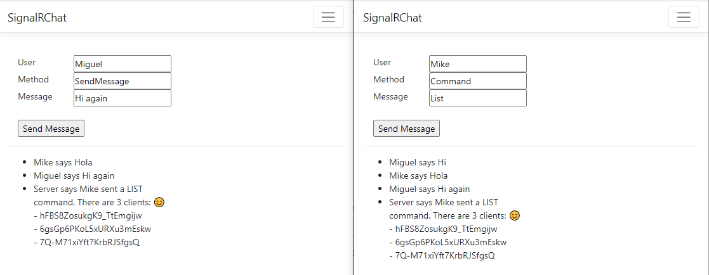
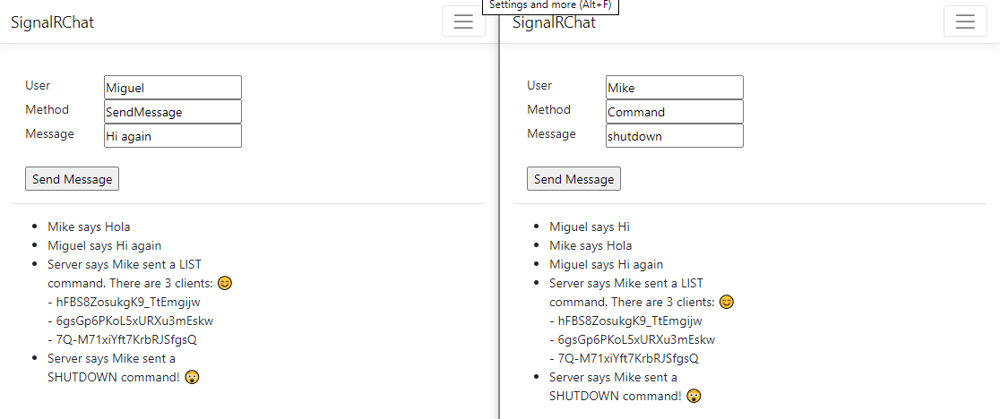

# explore-signalr

Variations on the [official SignalR tutorial](https://docs.microsoft.com/aspnet/core/tutorials/signalr)

Besides the original `SendMessage`, method the hub also handles the `Command` method, and understands the **LIST** command.

The hub also understands the **SHUTDOWN** command.

